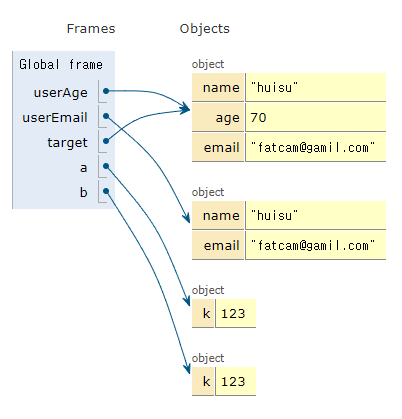
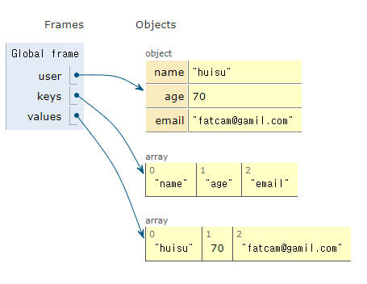

## JavaScript Level up

## Part. 4

### JS 데이터

<a href='https://developer.mozilla.org/ko/' target='_blank'>MDN</a>

##### 문자

- String: 전역 객체는 문자열(문자의 나열)의 생성자입니다.

###### 자주 사용되는 Methods

- String.prototype.indexOf()
- indexOf() 메서드는 호출한 String 객체에서 주어진 값과 일치하는 첫 번째 인덱스를 반환합니다.
- 일치하는 값이 없으면 - 1을 반환합니다.

```js
const result = "Hello world!".indexOf("world");
const result2 = "Hello world!".indexOf("huisu");
console.log(result); // 6
console.log(result2); // -1
```

- length() 메소드는 문자열의 길이를 측정하여 숫자로 반환한다

```js
const str = "01 23";
console.log(str.length); // 5
const str2 = "Hello world!";
console.log(str2.indexOf("huisu") !== -1); // false
```

- slice() 메소드는 문자열의 일부를 추출하면서 새로운 문자열을 반환한다.
- str.slice(beginIndex, endIndex)
- endIndex: 0부터 시작하는 추출 종료점 인덱스로 그 직전까지 추출됩니다.
  - 인덱스 위치의 문자는 추출에 포함되지 않습니다.

```js
console.log(str2.slice(6, 11)); // world
```

- replace() 메서드는 어떤 패턴에 일치하는 일부 또는 모든 부분이 교체된 새로운 문자열을 반환

```js
console.log(str2.replace("world", "huisu")); // Hello huisu
console.log(str2.replace(" world!", "")); // Hello
```

- match() 메서드는 문자열이 정규식과 매치되는 부분을 검색

```js
const email = "fatcam@gmail.com";
console.log(email.match(/.+(?=@)/)[0]); // fatcam
```

- trim() 메서드는 문자열 양 끝의 공백을 제거합니다.

```js
const str3 = "        Hello world   ";
console.log(str3.trim());
```

##### 숫자 와 수학

###### 자주 사용되는 Number Methods

- Number 는 37이나 -9.25와 같은 숫자를 표현하고 다룰 때 사용하는 원시 래퍼 객체
- toFixed() 메서드는 숫자를 고정 소수점 표기법
- Number.parseInt() 메서드는 문자열 인자를 파싱하여 특정 진수의 정수를 반환
- Number.parseFloat() 메서드는 주어진 값을 필요한 경우 문자열로 변환한 후 부동소수점 실수로 파싱해 반환합니다
  - 숫자를 파싱할 수 없는 경우 NaN을 반환

```js
const pi = 3.14159265358979;

const str = pi.toFixed(2); // 3.14
console.log(str); // 3.14
console.log(typeof str); // string

const integer = parseInt(str); // 3
const float = parseFloat(str); // 3.14
console.log(integer);
console.log(float);
console.log(typeof integer, typeof float); // number, number
```

###### 자주 사용되는 Math Methods

- Math는 수학적인 상수와 함수를 위한 속성과 메서드를 가진 **내장 객체**입니다.
- 함수 객체가 아닙니다.
- Math.abs() 함수는 주어진 숫자의 절대값을 반환
  - -1 > 1, -99 > 99
- Math.min() 주어진 숫자들 중 가장 작은 값을 반환
- Math.max() 입력값으로 받은 0개 이상의 숫자 중 가장 큰 숫자를 반환
- Math.ceil() 입력값을 올림 처리 후 반환
- Math.floor() 입력값을 내림 처리 후 반환
- Math.round() 입력값을 반올림 처림 후 반환
- Math.random() 0 이상 1 미만의 구간에서 근사적으로 균일한(approximately uniform) 부동소숫점 의사난수를 반환

```js
Math.abs(-12); // 12
Math.min(2, 8); // 2
Math.max(2, 8); // 8
Math.ceil(3.14); // 4
Math.floor(3.14); // 3
Math.round(3.5); // 4
Math.random(); // 0.2545875
```

##### 배열

- Array 클래스는 리스트 형태의 고수준 객체인 배열을 생성할 때 사용하는 전역 객체
- 배열의 인덱스는 0부터 시작
- 배열 첫 번째 요소의 인덱스는 0
- 마지막 요소의 인덱스는 배열의 length 속성에서 1을 뺀 것과 같다.

###### Array Properties

- Array 인스턴스의 length 속성은 배열의 길이를 반환

```js
const numbers = [1, 2, 3, 4];
const fruits = ["Apple", "Banana", "Cherry"];

numbers.length; // 4
fruits.length; // 3
```

###### 자주 사용되는 Array Methods

- find() 주어진 판별 함수를 만족하는 첫 번째 요소의 값을 반환
  - 그런 요소가 없다면 undefined를 반환
- concat() 기존 배열에 합쳐서 새 배열을 반환
  - 원본의 데이터의 손상은 없다.
- forEach() 주어진 함수를 배열 요소 각각에 대해 반복 실행
  - 반환되는 값은 없다
- map() 배열 내의 모든 요소 각각 반복 실행 후 결과를 새로운 배열에 반환
  - 원본의 데이터의 손상은 없다.

```js
const numbers = [1, 2, 3, 4];
const fruits = ["Apple", "Banana", "Cherry"];

console.log(numbers.concat(fruits));
// [1, 2, 3, 4, 'Apple', 'Banana', 'Cherry']
console.log(numbers);
// [1, 2, 3, 4]
console.log(fruits);
// ['Apple', 'Banana', 'Cherry']

fruits.forEach(function (item, index) {
  console.log(element, index);
});
/* Apple 0
  Banana 1
  Cherry 2 */

fruits.map(function (item, index) {
  return {
    id: index,
    name: item,
  };
});

// 화살표 함수로 작성시
fruits.map((item, index) => ({
  id: index,
  name: item,
}));
```

- filter() 함수 조건의 "참"인 요소의 값을 배열로 반환
  - 원본의 데이터의 손상은 없다.

```js
const numbers = [1, 2, 3, 4];

const a = numbers.map((number) => number < 3);

console.log(a); // [true, true, false, false] : 모든 "결과" 를 반환

const b = numbers.filter((number) => {
  return number < 3;
});

console.log(b); // [1, 2] : 통과한 요소의 "값"을 반환
```

- findIndex() 조건을 만족하는 배열의 첫 번째 요소의 인덱스를 반환

```js
const b = fruits.findIndex((fruit) => /^B/.test(fruit));

console.log(b); // 1
```

- includes() 배열에 특정 요소를 포함 하는지 판별 true, false

```js
const a = numbers.includes(3); // true
const b = fruits.includes("huisu"); // false
```

###### 자주 사용되는 Array Methods 중 원본이 수정 됨

- push() 배열의 끝에 요소를 추가
- unshift() 배열의 맨 앞에 요소를 추가

```js
const numbers = [1, 2, 3, 4];
numbers.push(5); // [1, 2, 3, 4, 5]
numbers.unshift(0); // [0, 1, 2, 3, 4, 5]
```

- reverse() 배열의 순서를 거꾸로

```js
numbers.reverse(); // [5, 4, 3, 2, 1, 0]
fruits.reverse(); // ['Cherry', 'Banana', 'Apple']
```

- splice(begin, end, new) 배열의 begin에서 end 까지 삭제 후 배열 반환
  - 삭제된 배열의 위치에 new를 끼워넣음

```js
numbers.splice(2, 1); // [1, 2, 4]
numbers.splice(2, 1, 9); // [1, 2, 9, 4]

const fruits = ["Apple", "Banana", "Cherry"];
fruits.splice(2, 0, "orange"); // ['Apple', 'Banana', 'orange', 'Cherry']
```

##### 객체

###### Static Methods

- Object.assign() 출처 객체를 복사하여, 대상 객체로 속성을 넣음. 대상 객체를 반환

```js
const userAge = {
  // key: value
  name: "huisu",
  age: 70,
};

const userEmail = {
  name: "huisu",
  email: "fatcam@gamil.com",
};

const target = Object.assign(userAge, userEmail);
console.log(target); //{name: 'huisu', age: 70, email: 'fatcam@gamil.com'}
console.log(userAge); //{name: 'huisu', age: 70, email: 'fatcam@gamil.com'}
console.log(target === userAge); // true

const a = { k: 123 };
const b = { k: 123 };
console.log(a === b); // false
```



- Object.keys() 객체 데이터 안의 키 값을 추출 하여 새로운 배열 데이터로 반환

```js
const user = {
  // key: value
  name: "huisu",
  age: 70,
  email: "fatcam@gamil.com",
};

const keys = Object.keys(user);
console.log(keys); // ['name', 'age', 'email']

console.log(user["email"]); // fatcam@gamil.com

const values = keys.map((key) => user[key]);
console.log(values); // ['huisu', 70, 'fatcam@gamil.com']
```



##### 구조 분해 할당 Destructring assignment (=비구조화 할당)

```js
// Object
const user = {
  name: "huisu",
  age: 70,
  email: "fatcam@gamil.com",
};

const { name: Myname, age, email, address = "Korea" } = user;
// E.g, user.address
//const name = user.name;
//const name = user['name']

console.log(Myname, age, email, address); // huisu 70 fatcam@gamil.com Korea

// Array
const fruits = ["Apple", "Banana", "Cherry"];
const [, , a] = fruits;
console.log(a); // Cherry
```

- 객체 데이터, 배열 데이터 사용 가능

##### 전개 연산자 Spread

```js
const fruits = ["Apple", "Banana", "Cherry", "orange"];

console.log(...fruits); // Apple Banana Cherry orange

function toObj(a, b, ...c) {
  return {
    a: a,
    b,
    c,
  };
}
// 축약형 const toObj = (a, b, ...c) => ({ a, b, c });

console.log(toObj(...fruits)); //{a: 'Apple', b: 'Banana', c: Array(2)}
```

### JS 데이터 실습

##### 가져오기, 내보내기

- Import: 가져오기
- Default export: 기본으로 내보내기 (이름을 지정할 필요가 없음)
- Named export: 이름을 지정 후 내보내기

```js
// Named export (getRandom.js)
// 여러번 사용이 가능하다

export function random() {
  return Math.floor(Math.random() * 10);
}

export const user = {
  name: "huisu",
  age: 80,
};

// 같이 사용 가능
export default 123;
```

```js
// default 는 한번만 사용 가능 (getType.js)
export default function (data) {
  return Object.prototype.toString.call(data).slice(8, -1);
}
```

```js
// main.js
import _ from "lodash"; // From 'node_modules!'
import getType from "../part3/getType";
//import { random, user as huisu } from "../part3/getRandom";
// 한번에 가져올 경우
import * as R from "../part3/getRandom";

console.log(_.camelCase("the hello world"));
console.log(getType([1, 2, 3]));
//console.log(random(), random());
console.log(R); // {default: 123, user: {…}, __esModule: true, random: ƒ}
```

##### Lodash 사용법

<a href="https://lodash.com/" target="_blank">Lodash</a>

- .uniqBy(배열, 속성이름) 중복된 데이터를 제거 후 반환
  - 합친 후 이미 중복이 발생한 경우 사용
- .unionBy(배열1, 배열2, 속성이름) 중복된 데이터를 제거 후 반환
  - 합치기 전 중복이 발생되지 않은 2개 이상의 배열일 때 사용

```js
const UserA = [
  { userId: "1", name: "huisu" },
  { userId: "2", name: "janghun" },
];

const UserB = [
  { userId: "1", name: "huisu" },
  { userId: "3", name: "Oksun" },
];

const UserC = UserA.concat(UserB);
console.log("concat", UserC);
console.log("uniqBy", _.uniqBy(UserC, "userId"));

const UserD = _.unionBy(UserA, UserB, "userId");
console.log("unionBy", UserD);
```

- .find(배열, 아이템) 해당되는 데이터를 찾아서 반환
- .findIndex(배열, 아이템) 해당되는 데이터가 위치한 index 번호를 반환
- .remove(배열, 아이템) 해당되는 요소를 찾아서 제거 후 반환

```js
const users = [
  { userId: "1", name: "huisu" },
  { userId: "2", name: "janghun" },
  { userId: "3", name: "Oksun" },
];

const foundUser = _.find(users, { name: "huisu" }); //{userId: '1', name: 'huisu'}
const foundUserIndex = _.findIndex(users, { name: "huisu" }); // 0

_.remove(users, { neme: "huisu" }); // [{…}, {…}, {…}]
```

##### JSON 자바스크립트의 객체 표기법 JavaScript Object Notation

<a href="https://ko.wikipedia.org/wiki/JSON" target="_blank">위키백과</a>

> JSON의 공식 인터넷 미디어 타입은 application/json이며, JSON의 파일 확장자는 .json이다.
> 문자열(String): 0개 이상의 유니코드 문자들의 연속. 문자열은 큰 따옴표(")로 구분하며 역슬래시 이스케이프 문법을 지원한다.
> 한 가지의 데이터 타입을 가진다.

```json
{
  "string": "huisu",
  "number": 123,
  "boolean": true,
  "null": null,
  "object": {},
  "array": []
}
```

```js
import myData from "./MyData.json";
// 문자화
const str = JSON.stringify(user);
// string , {"name":"huisu","age":70,"emails":["dlkwjlkfjld@naver.com","dlejlejlw@naver.com"]}

// 객체화
const obj = JSON.parse(str);
// {name: 'huisu', age: 70, emails: Array(2)}
```

##### Storage 데이터를 저장하는 장소

- Window.localStorage
  > localStorage 읽기 전용 속성을 사용하면 Document 출처의 Storage 객체에 접근할 수 있습니다. 저장한 데이터는 브라우저 세션 간에 공유, 데이터는 만료되지 않음
  > sessionStorage의 데이터는 페이지 세션이 끝날 때, 즉 페이지를 닫을 때 사라진다.
- localStorage.setItem('key', 'value') 데이터 저장
- localStorage.getItem('key') 데이터 항목 읽기
- localStorage.removeItem('key') 데이터 삭제
- localStorage.clear() 항목 전체 제거

```js
const user = {
  name: "huisu",
  age: 70,
  emails: ["dlkwjlkfjld@naver.com", "dlejlejlw@naver.com"],
};

localStorage.setItem("user", user);
user2 = JSON.stringify(user);
localStorage.setItem("user2", user2);
```


##### OMDb API

- Query String
  - 주소? 속성=값&속성=값&속성=값
  - 설치 방법
    > https://github.com/axios/axios
    > npm install axios

```html
<h1>hello</h1>

```

```js
import axios from "axios";

function fetchMovies() {
  axios.get("https://www.omdbapi.com/?apikey=7035c60c&s=frozen").then((res) => {
    console.log(res);
    const h1El = document.querySelector("h1");
    const imgEl = document.querySelector("img");
    h1El.innerText = res.data.Search[0].Title;
    imgEl.src = res.data.Search[0].Poster;
  });
}

fetchMovies();
```
