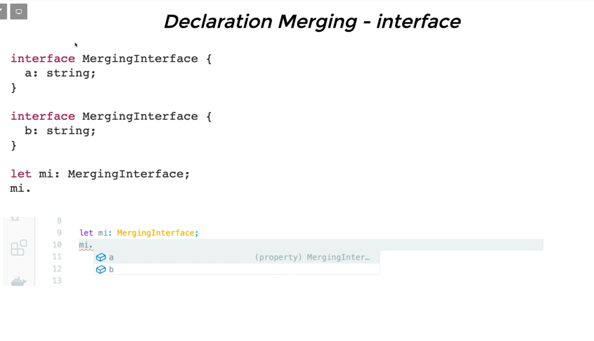
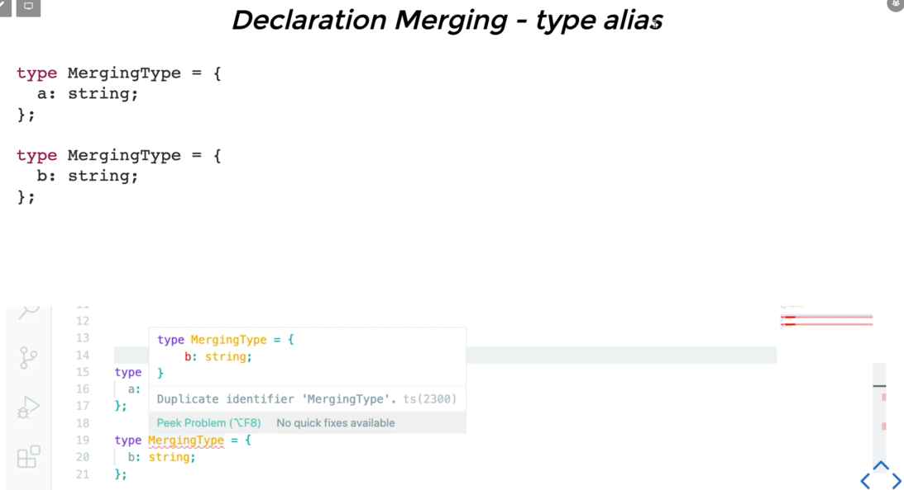

## TypeScript Essentials

## Part 5 Ch. 05

### Interfaces

```ts
function hello1(person: { name: string; age: number }): void {
  console.log(`안녕하세요 ${person.name}입니다.`);
}

const p1: { name: string; age: number } = {
  name: "Mark",
  age: 39,
};

hello1(p1);
```

```ts
// { name: string; age: number } 대신
interface Person1 {
  name: string;
  age: number;
}

function hello1(person: Person1): void {
  console.log(`안녕하세요 ${person.name}입니다.`);
}

const p1: Person1 = {
  name: "Mark",
  age: 39,
};
```

```js
//컴파일후
"use strict";
function hello1(person) {
  console.log(`안녕하세요 ${person.name}입니다.`);
}
const p1 = {
  name: "Mark",
  age: 39,
};
hello1(p1);
```

### optional property

```ts
interface Person2 {
  name: string;
  age?: number; // age || undefined
}

function hello2(person: Person2): void {
  console.log(`안녕하세요 ${person.name}입니다.`);
}

hello2({ name: "huisu", age: 31 });
hello2({ name: "janghun" });
```

```ts
interface Person3 {
  name: string;
  age?: number;
  [index: string]: any;
}

function hello3(person: Person3): void {
  console.log(`안녕하세요! ${person.name}입니다.`);
}

const p31: Person3 = {
  name: "huisu",
  age: 31,
};

const p32: Person3 = {
  name: "janghun",
  systers: ["Sung", "Chan"],
};

const p33: Person3 = {
  name: "hojun",
  father: p31,
  mother: p32,
};

hello3(p33);
```

### function in interface

```ts
interface Person4 {
  name: string;
  age?: number;
  hello(): void;
}

const p41: Person4 = {
  name: "huisu",
  age: 31,
  hello: function (): void {
    console.log(`안녕하세요! ${this.name} 입니다!`);
  },
};

const p42: Person4 = {
  name: "huisu",
  age: 31,
  hello(): void {
    console.log(`안녕하세요! ${this.name} 입니다!`);
  },
};

const p43: Person4 = {
  name: "huisu",
  age: 31,
  hello: (): void => {
    console.log(`안녕하세요! ${this.name} 입니다!`); // this 사용 불가
  },
};

p41.hello(); // 안녕하세요! huisu 입니다!
```

### class implements interface

```ts
interface IPerson1 {
  name: string;
  age?: number;
  hello(): void;
}

class Person implements IPerson1 {
  name: string;
  age?: number | undefined;

  constructor(name: string) {
    this.name = name;
  }

  hello(): void {
    console.log(`안녕하세요! ${this.name} 입니다!`);
  }
}

const person12: IPerson1 = new Person("huisu");
```

### interface extends interface

```ts
interface IPerson2 {
  name: string;
  age?: number;
}

interface IKorean extends IPerson2 {
  city: string;
}

const k: IKorean = {
  name: "huisu",
  city: "서울",
};
```

### function interface

```ts
interface HelloPerson {
  (name: string, age?: number): void;
}

const helloPerson: HelloPerson = function (name: string, age?: number) {
  console.log(`안녕! ${name}이야.`);
};
```

### Readonly Interface Properties

```ts
interface Person8 {
  name: string;
  age?: number;
  readonly gender: string;
}

const p81: Person8 = {
  name: "hojun",
  gender: "male",
};

p81.gender = "female"; // error 변경 불가능
```

### type alias vs interface

```ts
function
// type alias
type EatType = ( food: string ) => void;

// interface
interface IEat {
  (food: string): void;
}
```

```ts
Array;
// type alias
type PersonList = string[];

// interface
interface IPersonList {
  [index: number]: string;
}
```





## Part 5 Ch. 06

### Classes

- object를 만드는 blueprint(청사진, 설계도)
- 클래스 이전에 object를 만드는 기본적인 방법은 function
- JS 에도 class 는 ES6 부터 사용 가능
- OOP 을 위한 초석
- TypeScript 에서는 클래스도 사용자가 만드는 타입의 하나

```ts
class Person {
  name;

  constructor(name: string) {
    this.name = name;
  }
}

const p1 = new Person("huisu");
```

- class 키워드를 이용하여 클래스를 만들 수 있다.
- class 이름은 보통 대문자를 이용한다
- new 를 이용하여 class를 통해 object를 만들 수 있다.
- constructor를 이용하여 object를 생성하면서 값을 전달할 수 있다.
- this 를 이용해서 만들어진 object를 가리킬 수 있다.
- JS 컴파일되면 es5의 경우 function 으로 변경된다.

### constructor vs initialize

- 생성자 함수가 없으면, 디폴트 생성자가 불린다.
- 프로그래머가 생성자가 하나라도 있으면, 디폴트 생성자는 사라진다.
- strict 모드에서는 프로퍼티를 선언하는 곳 또는 생성자에서 값을 할당해야한다.
- 프로퍼티를 선언하는 곳 또는 생성자에서 값을 할당하지 않는 경우에는 !를 붙여서 위험을 표현한다.
- 클래스의 프로퍼티가 정의되어 있지만, 값을 대입하지 않으면 undefined 이다.
- 생성자에는 async를 설정할 수 없다.

### 접근제어자 Access Modifiers

- 접근 제어자는 public, private, protected 가 있다.
- 설정하지 않으면 public 이다
- 클래스 내부의 모든 곳에 (생성자, 프로퍼티, 메소드)설정 가능하다.
- private 으로 설정하면 클래스 외부에서 접근할 수 없다.
- 자바스크립트에서 private 지원하지 않아 오랫동안 프로퍼티나 메서드 이름앞에 \_를 붙여서 표현했다.

### initialization in constructor parameters

```ts
class Person {
  public constructor(public name: string, private age: number) {}
} // age는 접근제어

const p1: Person = new Person("soo", 31);
```

### Getters & Setters

```ts
class Person {
  public constructor(public _name: string, private age: number) {}

  // get : 값을 얻어오기
  get name() {
    return this._name;
  }
  // set : 값을 설정하기
  set name(n: string) {
    this._name = n;
  }
}

const p1: Person = new Person("soo", 31);
console.log(p1.name); // get 을 하는 함수 getter  "soo"
p1.name = "huisu"; // set 을 하는 함수 setter
console.log(p1.name); // "huisu"
```

### readonly properties

- 최초값만 설정가능하고, 수정은 안된다.

```ts
class Person {
  public readonly name: string = "Mark";
  private readonly country: string;

  public constructor(public _name: string, private age: number) {
    this.country = "Korea";
  }

  hello() {
    this.country = "China"; // error
    //Cannot assign to 'country' because it is a read-only
  }
}
```

### Index Signatures in class

- class => object

```ts
// {mark: 'male', jade: 'male'}
// {chloe: 'femali', alex: 'male', anna: 'female'}

class Student {
  [index: string]: "male" | "female";
}

const a = new Student();
a.mark = "male";
a.jade = "male";

// a = Students {mark: 'male', jade: 'male'}

const b = new Student();
b.chloe = "female";
b.alex = " male";
b.anna = "female";

// b = Students {chloe: 'femali', alex: 'male', anna: 'female'}
```

### Static Properties & Methods

- class 에서 바로 사용

```ts
class Person {
  public static CITY = "Seoul";
  public static hello() {
    console.log("안녕하세요", Person.CITY);
  }
}

const p1 = new Person();

Person.hello(); // 안녕하세요 Seoul
```

### Singletons

- 데이터가 공유된다.

```ts
class ClassName {
  private static instance: ClassName | null = null;
  public static getInstance(): ClassName {
    // ClassName 으로 부터 만든 object가 있으면 그걸 리턴
    // lassName 으로 부터 만든 object가 없으면, 만든다
    if (ClassName.instance === null) {
      ClassName.instance = new ClassName();
    }
    return ClassName.instance;
  }
  private constructor() {}
}

const a = ClassName.getInstance();
const b = ClassName.getInstance();

// 결론 : a === b
```

### 상속 Inheritance

```ts
class Parent {
  constructor(protected _name: string, private _age: number) {}

  public print(): void {
    console.log(`이름은 ${this._name}이고, 나이는 ${this._age}입니다.`);
  }
}

const p = new Parent("soo", 31);
p.print(); // 이름은 soo 이고 나이는 31 입니다

class Child extends Parent {}
```

#### Abstract Classes

```ts
abstract class AbstractPerson {
  protected _name: string = "soo";

  abstract setName(name: string): void;
}

// new AbstractPerson()

class Person extends AbstractPerson {
  setName(name: string): void {
    this._name = name;
  }
}

const p = new Person();
p.setName();
```
