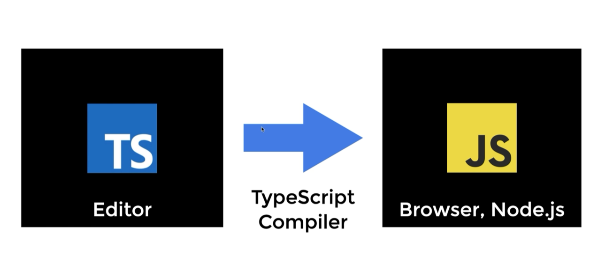

## TypeScript Essentials

## Part 5 Ch. 01 ~ Ch. 02

### TypeScript 란 무엇인가

> https://www.typescriptlang.org/
>
> > - TypeScript is JavaScript with syntax for types.
> > - By understanding JavaScript, TypeScript saves you time catching errors and providing fixes before you run code
> > - Any brower, any OS, anywhere Javascript runs. Entirely Open Source.

> - 타입스크립트는 'Programming Language 언어' 입니다.
> - 타입스크립트는 'Compiled Language' 입니다.
>   - 전통적인 Compiled Language 와는 다른 점이 많습니다.
>   - 그래서 'Transpile'이라는 용어를 사용하기도 합니다.
> - 자바스크립트는 'Interpreted Language' 입니다.

| .                | Compiled                        | Interpreted                   |
| ---------------- | ------------------------------- | ----------------------------- |
| 컴파일 필요      | O                               | X                             |
| 컴파일러 필요    | O                               | X                             |
| 컴파일 사는 시점 | O = 컴파일 타임                 | X                             |
|                  | 컴파일된 결과물을 실행          | 코드 자체를 실행              |
|                  | 컴파일된 결과물을 실행하는 시점 | 코드를 실행하는 시점 = 런타임 |

- Compiler
  - 컴파일이란, 어떤 언어의 코드를 다른 언어로 바꿔주는 과정
  - 컴파일러를 엄밀히 말하자면, 어떤 프로그래밍 언어로 쓰여진 소스 파일을 다른 프로그래밍 언어로 바꾸어주는 번역기이다.
  - 대개의 경우 고수준 언어를 기계어로 번역하는 프로그램을 일컫는다



### TypeScript 설치 및 사용

```
설치 방법
npm i typescript -g
```

```
사용 방법 (컴파일)
tsc --init : 기본 설정으로 컴파일
tsc test.ts : 컴파일 ts -> js
tsc -w : 파일 내용이 수정 될 때마다 자동으로 컴파일 됨
```

```
삭제 방법
npm uninstall typescript -g
```

```
프로젝트에 설치하는 방법
npm i typescript -D : 개발 모드로 설치하는 것을 추천
```

```
프로젝트 내에서 실행 방법
npx tsc --init : 기본 설정으로 컴파일
npx tsc : 컴파일 실행
npx tsc -w : 파일 내용이 수정 될 때마다 자동으로 컴파일 됨
```

```json
"scripts": {
    "dev": "parcel 220422/REGEXP/index.html",
    "build": "tsc"
  }
npm run build 으로 실행
```

### First Type Annotation

```ts
let a = "Mark"; // a 는 문자로 타입이 지정됨
a = 39; // error
```

```ts
let a: number; // a 의 타입을 숫자로 지정
a = 39; // ok

function hello(b: number) {} // 함수의 인자를 숫자로 지정

hello("mark"); // error
```

### Basic Types

#### TypeScript Types vs JavaScript Types

| TypeScript Types                       | JavaScript Types                    |
| -------------------------------------- | ----------------------------------- |
| Static Types (set druring development) | Dynamic Types (resolved at runtime) |

```
//JavaScript
function add (n1, n2) {
  if (typeof n1 !== 'number || typeof n2 !== 'number){
    throw new Error('Incorrect input!);
  }
  return n1 + n2;
}
// TypeScript
function add (n1: number, n2:number){
  return n1 + n2
}

const result = add(39, 28)
```

> 프로그램이 유용하려면, 가장 간당한 데이터 단위로 작업 할 수 있어야 한다.
> TypeScript 에서, 우리는 JavaScript 에서 기대하는 것과 동일한 타입을 지원하며, 돕기 위해 추가적인 열거 타입이 제공 된다.

- TypeScript 기본 제공하는 데이터 타입
  - JsvaScript 기본 자료형을 포함 (superset)
  - Boolean, Number, String, Null, Undefined, symbol, Array
  - 추가된 몇가지 타입
  - Any, Void, Never, Unknown
  - Enum
  - Tuple: Object 형

#### Primitive Type

- 오브젝트와 레퍼런스 형태가 아닌 **실제 값을 저장**하는 자료형
- 프리미티브 형의 내장 함수를 사용 가능한 것은 자바스크립트 처리 방식 덕분
- boolean, number, string, symbol, null, undefined
- literal 값으로 primitive 타입의 서브 타입을 나타낼 수 있다.
- 또는 래퍼 객체로 만들 수있다 ex) new Boolean(false); new Number(43);

- TypeScript 의 핵심 Primitive types은 모두 소문자이다
- Number, String, Boolean, Symbol 또는 Object 유형이 소문자 버전과 동일하다고 생각할 수 있으나, 이러한 유형은 언어 primitives를 나타내지 않으며, 타입으로 사용해서는 안된다.

```ts
function reverse(s: String): String {
  return s.split("").reverse().join("");
}

// 옳은 기재법
function reverse(s: string): string {
  return s.split("").reverse().join("");
}
```

#### boolean

```ts
let isDone: boolean = false;
isDone = true;
console.log(typeof isDone); // boolean
let isOk: Boolean = true;
let isNotOk: boolean = new Boolean(true);
```

#### number

```ts
let decimal: number = 6; // 10진수

let hex: number = 0xf00d; // 16잔수

let binary: number = 0b1010; // 2진수

let octal: number = 0o744; // 8진수

let notANumber: number = NaN;

let underscoreNum: number = 1_000_000;
```

#### string

- 다른 언어에서와 마찬자기로이 텍스트 형식을 참조하기 위해 'string' 형식을 사용한다.
- "" ,'' 을 사용

##### Template String

- 행에 걸쳐 있거나, 표현식을 넣을 수 있는 문자열
- 이 문자열은 backtick (backquote) 기호에 둘러쌓여 있다.
- 표함된 표현식은 `${expr}` 와 같은 형태롤 사용

```ts
let myName: string = "Mark";
myName = "Anna";
let fullName: string = "Mark Lee";
let age: number = 39;

let sentence: string = `Hello, my name is ${fullName}

I'll be ${age + 1} years old next month`;
console.log(sentence);
```

#### Symbol

- ECMAScript 2015 의 Symbol
- new Symbol로 사용할 수 없다.
- Symbol 을 함수로 사용해서 symbol 타입을 만들어 낼 수 있다.
- 프리미티브 타입의 값을 담아서 사용한다.
- 고유하고 수정불가능한 값으로 만든다.
- 주로 접근을 제어하는데 쓰는 경우가 많다.

```tsconfig.json
"lib": [
      "ES2015",
      "DOM"]
```

```ts
console.log(Symbol("foo") === Symbol("foo")); // false

const sym = Symbol();

const obj = {
  [sym]: "value",
};

obj[sym];
```

#### Undefined & null

- TypeScript 에서, undefined 와 null은 실제로 각각 undefined 및 null 이라는 타입을 가진다.
- void와 마찬가지로, 그 자체로는 유용하지 않는다.
- 둘다 소문자만 존재한다

```ts
// 이 변수들에 할당할 수 있는 것들은 거의 없다
let u: undefined = undefined;
let n: null = null;
let u: undefined = null; // error
let v: void = undefined;

let union: string | null = null;

union = "Mark";
```

##### null in JavaScript

- null 이라는 값으로 할당된 것을 null 이라고 합니다.
- 무언가가 있는데, 사용할 준비가 덜 된 상태
- null 이라는 타입은 null 이라는 값만 가질 수 있다.
- _런타임에서 typeof 연산자를 이용해서 알아내면, object 이다._

##### undefined in JavaScript

- 값을 할당하지 않은 변수는 undefined 라는 값을 가진다.
- 무언가가 아예 준비가 안된 상태
- object 의 property 가 없을 때도 undefined 입니다.
- _런타임에서 typeof 연산자를 이용해서 알아내면, undefined이다._

#### object

- a type that represents the non-primitive type
- "primitive type이 아닌 것"을 나타내고 싶을 때 사용하는 타입
- non-primitive type
  - not number, string, boolean, bigint, symbol, null, or undefined

```ts
// creat by object literal
const person1 = { name: "Mark", age: 39 };

//person1 is not 'object' type.
//person1 is "{name:string, age:number}" type.

// creat by Object.craete
const person2 = Object.create({ name: "Mark", age: 39 });
```

#### Array

- 원래 자바스크립트에서 array 는 객체이다
- 사용방법
  - Array<타입>
  - 타입[]

```ts
let list: number[] = [1, 2, 3]; // 선호

let list2: Array<number> = [1, 2, 3];

let list3: (number | string)[] = [1, 2, 3, "4"];
```

#### Tuple

```ts
let x: [string, number];

x = ["hello", 39]; // 순서와 타입이 일치해야 함

x = [40, "hello"]; // erorr

x[3] = "world"; // index 위치도 일치해야한다. undefined

const person: [string, number] = ["mark", 39];

const [first, second, third] = person;
```

#### any

- 어떤 타입이어도 상관없는 타입이다.
- 이걸 최대한 쓰지 않는게 핵심이다.
- 왜냐면 컴파일 타임에 타입 체크가 정상적으로 이뤄지지 않기 때문이다.
- 컴파일 옵션 중에는 any 를 써야하는데 쓰지 않으면 오류를 뱉도록 하는 옵션이 있다.
  - nolmplicitAny
- any 는 계속해서 개체를 통해 전파된다.
- 결국 모든 편의는 타입안전성을 잃는 대가로 온다는 것을 기억
- 타입 안전성은 TypeScript 를 사용하는 주요 동기 중 하나이며 필요하지 않은 경우레는 any를 사용하지 않도록 해야한다.

```ts
function returnAny(message: any): any {
  console.log(message);
}

const any1 = returnAny("리턴은 아무거나");

any1.toString();

let looselyTyped: any = {};

let d = looselyTyped.a.b.c.d;
//  ^ = let d: any

function leakingAny(obj: any) {
  const a: number = obj.num;
  const b = a + 1;
  return b;
}

const c = leakingAny({ num: 0 });
c.indexOf("0"); // error
```

#### unknown

- 응용 프로그램을 작성 할 때 모르는 변수의 타입을 묘사해야 할 수도 있다.
- 이러한 값은 동적 콘텐츠(예: 사용자로부터, 또는 우리 API 의 모든 값을 의도적으로 수락하기를 원할 수 있다.)
- 이 경우, 컴파일러와 미래의 코드를 읽는 사람에게 이 변수가 무엇이든 될 수 있음을 알려주는 타입을 제공하기를 원하므로 unknown 타입을 제공
- Typescript 3.0 버전부터 지원
- any와 짝으로 any 보다 Type-safe 한 타입
  - any와 같이 아무거나 할당할 수 있다.
  - 컴파일러가 타입을 추론할 수 있게끔 타입의 유형을 좁히거나
  - 타입을 확정해주지 않으면, 다른 곳에서 할당할 수 없고, 사용 할 수 없다
- unknown 타입을 사용하면 runtime error 를 줄일 수 있을 것 같다
  - 사용 전에 데이터의 일부 유형의 검사를 수행해야 함을 알리는 API에 사용할 수 있을 것 같다.

```ts
declare const maybe: unknown;

const aNumber: number = maybe;

if (maybe === true) {
  const aBoolean: boolean = maybe;

  const aString: string = maybe;
}

if (typeof maybe === "string") {
  const aString: string = maybe;

  const aBoolean: boolean = maybe;
}
```

#### never

- never 타입은 모든 타입의 subtype 이며, 모든 타입에 할당 할 수 있다.
- never에는 그 어떤 것도 할당 할 수 없다.
- any 조차도 never에게 할달 할 수 없다.
- 잘못된 타입을 넣는 실수를 막고자 할때, 사용하기도 한다.

```ts
function error(message: string): never {
  throw new Error(message);
}

function fail() {
  return error("failed");
}

function infiniteLoop(): never {
  while (true) {}
}

declare const a: string | number;

if (typeof a !== "string") {
  a;
}

type Indexable<T> = T extends string ? T & { [index: string]: any } : never;

type ObectIndexable = Indexable<{}>;
```

#### void

- 어떤 타입도 가지지 않는 빈 상태

```ts
function returnVoid(message: string): void {
  console.log(message);

  return undefined;
}

const r = returnVoid("리턴이 없다");
```
