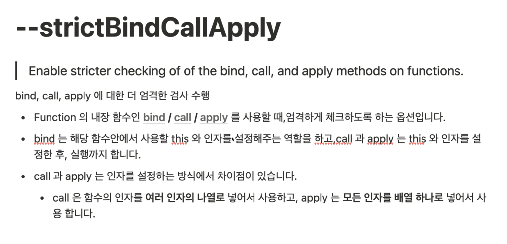

## TypeScript Essentials

## Part 5 Ch. 03

### 타입시스템

- 컴파일러에게 사용하는 타입을 명시적으로 지정하는 시스템
- 컴파일러가 자동으로 타입을 추론하는 시스템
- 타입스크립트의 타입시스템
  - 타입을 명시적으로 지정할 수 있다.
  - 타입을 명시적으로 지정하지 않으면, 타입스크립트 컴파일러가 자동으로 타입을 추론
- nolmplicitAny 옵션을 켜면
  - 타입을 명시적으로 지정하지 않은 경우, 타입스크립트가 추론 중 'any'라고 판단하게 되면, 컴파일 에러를 발생시켜 명시적으로 지정하도록 유도한다.
- strictNullChecks 옵션을 켜면, 모든 타입에 자동으로 포함되어 있는 'null' 과 'undefined'를 제거해줍니다.
- nolmplicitReturns 옵션을 켜면, 함수 내에서 모든 코드가 값을 리턴하지 않으면, 컴파일 에러를 발생시킨다.

### Structural Type System vs Nominal Type System

- Structural Type System 은 구조가 같으면, 같은 타입이다.
- Nominal Type System 은 구조가 같아도 이름이 다르면, 다른 타입이다.
- duck typing: 만약 어떤 새가 오리처럼 걷고, 헤엄치고, 꽥꽥거리는 소리를 낸다면, 나는 그 새를 오리라고 부를 것이다.


#### 타입 호환성 Type compatibility


##### StrictFunctionTypes 옵션을 켜면

- 함수를 할당할 시에 함수의 매개변수 타입이 같거나 슈퍼타입인 경우가 아닌경우, 에러를 통해 경고한다.


#### 타입 별칭 Type Alias

- Interface 랑 비슷해 보인다.
- Primitive, Union Type, Tuple, Function
- 기타 직접 작성해야하는 타입을 다른 이름을 지정할 수 있다.
- 만들어진 타입의 refer로 사용하는 것이지 타입을 만드는 것은 아니다.

- Aliasing Primitive

```ts
type MyStringType = string;
const str = "world";
let mySrt: MyStringType = "hello";
mystr = str;
/*
별 의미가 없다
*/
```

- Aliasing Union Type

```ts
let person: string | number = 0;
person = "Mark";

type StringOrNumber = string | number;

let another: StringOrNumber = 0;
another = "Anna";

/* 1. 유니온 타입은 A도 가능하고, B도 가능한 타입
   2. 길게 쓰는걸 짧게
*/
```

- Aliasing Tuple

```ts
let person: [string, number] = ["Mark", 35];
type PersonTuple = [string, number];
let another: PersonTuple = ["Anna", 24];
/* 1. 튜플 타입에 별칭을 줘서 여러군데서 사용할 수 있게 한다.
 */
```

- Aliading Function

```ts
type EatType = (food: string) => void;
```

## TypeScript Compiler

## Part 5 Ch. 04

### tsconfig schema

> http://json.schemastore.org/tsconfig

#### compileOnSave

```json
{
  "compileOnSave": true, // default false
  "compilerOptions": {}
}
```

#### extends

```json
{
  "extends": "./base.json",
  "compilerOptions": {}
}
```

```json
//base.json
{
  "compilerOptions": {
    "strict": true
  }
}
```

```
npm install --save-dev @tscongfig/deno
```

#### file, include, exclude

- 셋다 설정이 없으면, 전부다 컴파일
- files
  - 상대 혹은 절대 경로의 리스트 배열입니다.
  - exclude 보다 우선 적용
- include, exclude
  - glob 패턴 (마치 gitignore)
  - include
    - exclude 가 더 우선 적용
    - - 같은 걸 사용하면, .ts/ .tsx / .d.ts만 include (allowJS)
- exclude
  - 설정 안하면 4가지 (node_modules, brower_components, jspm_packages, <outDir>)를 default로 제외한다
  - <outDir> 은 항상 제외합니다 (include에 있어도)

#### compile options

##### typeRoots, types


##### target, lib


##### outDir, outfile, rootDir


##### strict

- 엄격하게 확인하는 타입의 옵션을 활성화함

  

- 옵션의 종류





