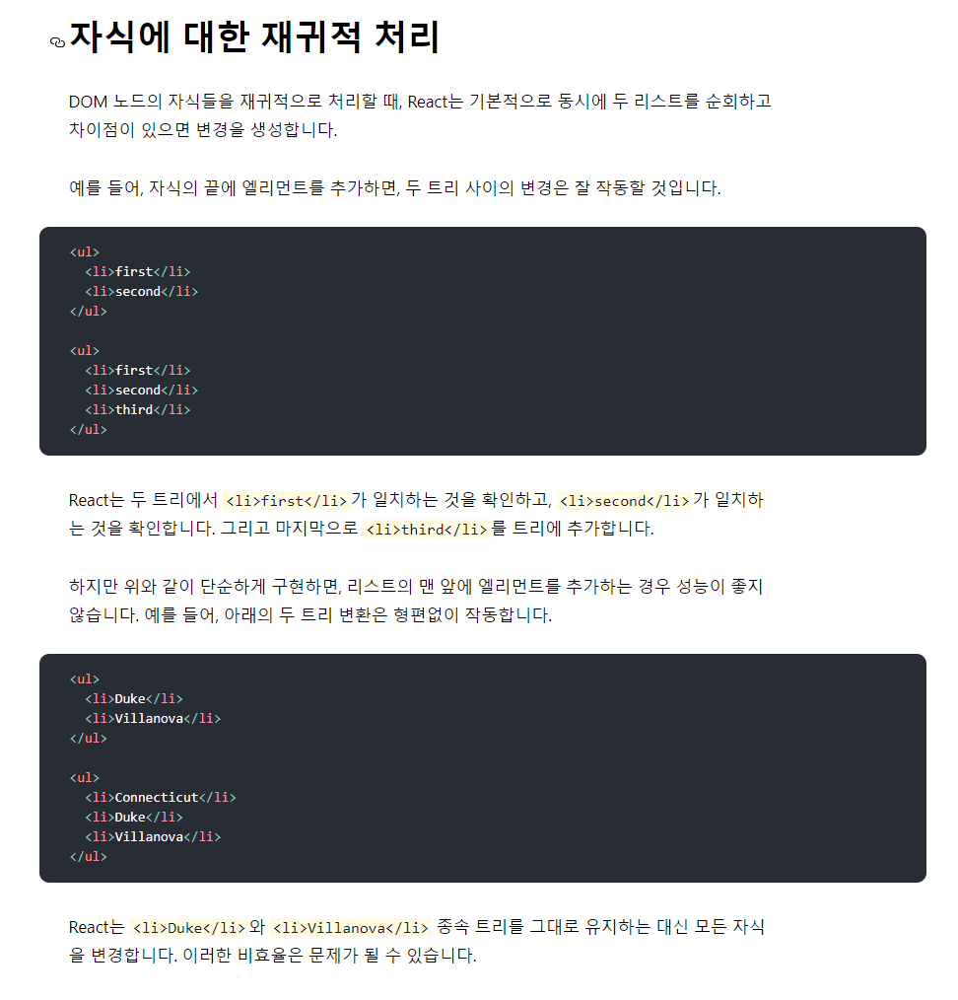
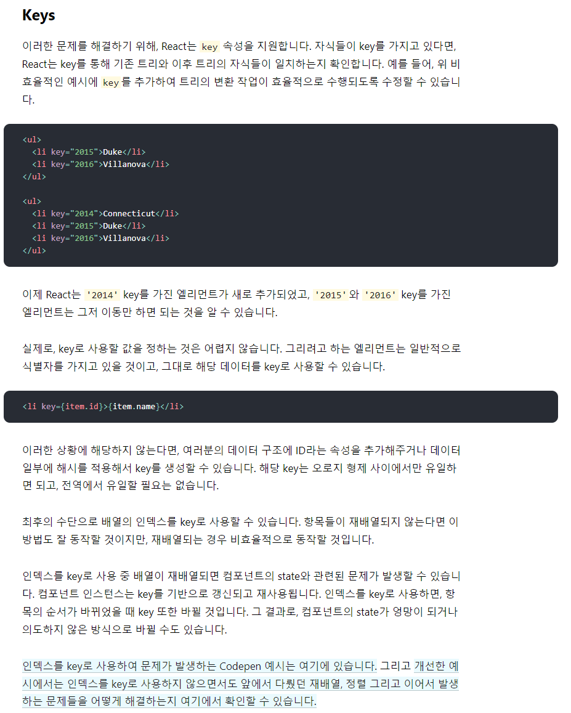
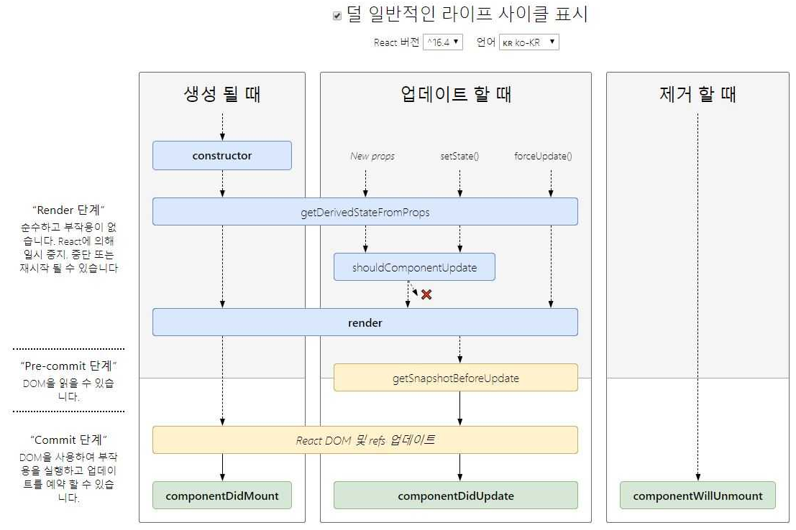

## Ch 01. React 맛보기

##### DOM 다루기 / Element 생성하기 정리

- CodeSandBox : 리액트 맛보기 동안 사용할 도구
- Vanilla js Dom : W3Schools / createElement
- CDN : unpkg
- React / React-dom : element 생성 / appendChild

##### JSX 와 Babel / JSX 다루기

- JSX: React.createElement 표현식
- Babel: JavaScript Complier
- JSX 다루기: spread 연산자

##### 멀티 Element 생성하기

- Fragment: React.Frament or <></>

##### Element 찍어내기

- Founction: 재사용이 가능한 Element
- Custom Element: Upper case
- Children 제한: 없음

##### JS 와 JSX 섞어쓰기

- Interpolation: 이미 HTML에서 쓰고 있었다.

###### 프론트엔드 개발의 장점?

- 눈에 보인다.
- 눈으로 **바로 확인**할 수 있다

#### 리액트 element에 스타일 입히기

> W3C School CSS buttons Try it yourself
> https://www.w3schools.com/css/tryit.asp?filename=trycss_buttons_color

- CSS 코드를 복사해올 수 있음
- 복사해 온 `HTML코드`를 script 내에
  - `const element 내 객체`에 복사해 줄 때
  - class대신 `className`으로 입력하는 것을 권장함
    - button과 같이 미리 정의된 태그는 class를 받지만 그렇지 않은 경우는 class로 입력하면 작동안할 수 있기때문
- 인라인으로 props를 전달할 때 camelCase로 입력해주고 중괄호{}로 닫아줌

```js
function Button({className = "", color, style, ...rest}) {
  return (
      <{`button ${className} ${color}`}
    style={{fonstSize:50, ...style, backgroundColor: "pink"}}
    {...rest}
    />;
  )
};

const element = {
  <>
      <Button color="blue" style={{borderRadius: 8, fontSize:20, backgroundColor: "red"}}>
        Green
      </Button>
  </>
}
```

- 속성 적용 우선순위
  - style태그 내 인라인 > className 내 속성
  - className -> 문자열
  - `style `-> 객체, `camelCase`, `className보다 먼저 적용`

---

#### Ref로 Dom 다루기

- input Element가 있고 화면이 뜨자마자 focus를 주고 싶을 때
  - `?.focus();`

> MDN의 document문서
> https://developer.mozilla.org/ko/docs/Web/API/Document
> Document 인터페이스는 브라우저가 불러온 웹페이지를 나타내며, DOM트리(페이지 컨텐츠)의 진입점 역할을 수행함

```js
const rootElement = document.getElementById('root');
const App = () => {
  const inputRef = React.useRef();
  const divRef = React.useRef();
  React.useEffect(() => {
    inputRef.current.focus();
    // document.getElementById('input').focus();

    setTimeout(() => {
      divRef.current.style.backgroundColor = 'pink';
    }; 1000)
  }, []);

  return (
    <>
    <input ref {inputRef} />
    <div style {{height:100, width:300, backgroundColor: 'brown'}}>
  </input>;
  );
};

ReactDOM.render(<App />, rootElement)
```

- `React`는 document.getElementByID를 사용하지 않고
- `useRef라는 별도의 방법을 제공함`
- ref(참조, 저장공간 값 개념)
- useref.current 라는 방법으로 이 값에 접근할 수 있음
- Vanilla JS에서 document.get~ 또는 query~를 썼다면
- React에서는 useRef/ref를 활용함

---

#### Form 다루기

> W3C School HTML Forms 예제
> https://www.w3schools.com/html/tryit.asp?filename=tryhtml_form_submit

```js
const rootElement = document.getElementById('root');
const App = () => {
  const handleSubmit = {event} => (
    event.preventDefault();
    // 새로고침 막음

    console.dir(event.target.elements);
    // 특정 엘리먼트 내 요소를 확인할 수 있는 방법

    alert(
      firstName: ${event.target.elements.fname.value},
      lastName: ${event.target.elements.lname.value}
      )
  )
  return (

<form onSubmit {handleSubmit}>
  <label for="fname">First name:</label><br>
  <input type="text" id="fname" name="fname" defaultValue="Joh4334n"><br>
  <label for="lname">Last name:</label><br>
  <input type="text" id="lname" name="lname" defaultValue="Doe"><br><br>
  <input type="submit" Value="Submit">
</form>
  )
};

ReactDOM.render(<App />, rootElement)
```

> Console dir - MDN 문서
> https://developer.mozilla.org/en-US/docs/Web/API/console/dir
> Console.dir 함수: 특정 엘리먼트 내 요소를 확인할 수 있는 방법
> HTML 태그들을 잘 활용할 수 있으나 일부 부분은 React에 맞는 값으로 바꿔줘야 함

---

#### Form 다루기 (uncontrolled vs controlled)

validation 유효성 검사 / value

```js
const rootElement = document.getElementById('root');
const App = () => {
  const { message: setMessage} = React.useState('')
  const {phonenumber, setPhoneNumber} = React.useState('')
  const handleSubmit = {event} => {
    event.preventDefault();
    // form의 기본적 동작실행 방지
    const phoneNumber = event.target.elements.phone.value;
    event(phoneNumber)

  const handleChange = {event} => {
    if(event.target.value.startsWith(0)) {
      setMessage('Phone Number is Valid');
      setPhoneNumber(evetn.target.value);
    } else if(event.target.value.length === 0) {
      setPhoneNumber('');
      setMessage('');
    } else {
      setMessage('Phone Number should start with 0')
    }
  }

  return (
    <form onSubmit {handleSubmit}>
      <label htmlFor 'phone'>Phone Number: </label>
      <br />
      <input id='phone' name='phone' onchange={handleChange} value {phoneNumber}/>
      <p>{message}</p>
      <br />
      <br />
      <button type='submit' disable {phoneNumber.length === 0 || message !== "Phone Number is value"}>Submit</button>
      <p>{phoneNumber}</p>
    </form>
    )
}

ReactDOM.render(<App />, rootElement)
```

---

#### Error 다루기

```js
try {
  ...
} catch(error) {
  ...
}
```

```js
  const rootElement = document.getElementById('root');
// catch error 보여주기
class ErrorBoundary extends React.Component (
  state = { error: null };
  static getDerivedStateFromError(error) {
    return { error }
  }

  render() {
    const (error) = this.state;
    if (error) {
      return <this.props.fallback error {error} />;
    }
    return this.props.children;
  }
)

const Child = () => {
  throw new Error('something wrong...')
  return <p>Child...</p>
}

const fallback = ({error}) => {
  return <p>{error.message}</p>
}

const App = () => {
  throw new Error('Something Wrong....');
  return (
  <>
    <p>App</p>
    // error가 났을때 보여줄 컴포넌트
    <ErrorBoundary fallback {fallback}>
    <Child />
    </ErrorBoundary>
  </>
)
}
ReactDOM.render(<App />, rootElement)

```

---

### Key 와 리렌더링 알아보기

- Key는 Value 를 **특정**하는 **이름**

```jsx
const todos = [
  { id: 1, value: "Wash dishes" },
  { id: 2, value: "Clean the bed" },
  { id: 3, value: "Running" },
  { id: 4, value: "Learnind" },
];

const App = () => {
  const [items, setItems] = React.useState(todos);

  const handleDoneClick = (todos) => {
    setItems((items) => items.filter((items) => item !== todo));
  };
};

const handleRetoreClick = () => {
  setItems((items) => [...items, todos.find((item) => !items.includes(item))]);
  return (
    <>
      {items.map((todo) => (
        <div>
          <span>{todo.value}</span>
          <button onclick={() => handleDoneClick(todo)}>Done</button>
        </div>
      ))}
      <button onclick={handleRetoreClick}>Restore</button>
    </>
  );
};

React.render(<App />, footElement);
```

> React Reconciliation 재조정
> https://ko.reactjs.org/docs/reconciliation.html //
>  //
> 

- 재사용: key를 제대로 줘야 재사용 가능
- 제대로 준다: 중복없고, 바뀌지 않는

### 상태 끌어올리기

- 로그인 폼
- ID, PASSWORD, BUTTON
- 단, id 와 password **모두입력** 되어 있을때만 button이 enabled 되도록 한다

```jsx
const rootElement = document.getElementById("root");

const ID = (handleIdChange) => {
  return (
    <>
      <label>ID: </label>
      <input onchange={handleIdChange}></input>
    </>
  );
};
const Password = (handlePasswordChange) => {
  return (
    <>
      <label>Password: </label>
      <input type="password" onchange={handlePasswordChange}></input>
    </>
  );
};

const App = () => {
  const [id, setId] = React.useState("");
  const [password, setPassword] = React.useState("");

  const handleIdChange = (event) => {
    setId(event.target.value);
  };

  const handlePasswordChange = (event) => {
    setPassword(event.target.value);
  };

  const handleLoginClick = () => {
    alert(`id: ${id}, pw: ${password}`);
  };

  return (
    <>
      <ID handleIdChange={handleIdChange}></ID>
      <br />
      <Password handlePasswordChange={handlePasswordChange}></Password>
      <button disabled={id.length === 0 || password.length === 0} onClick={handleLoginClick}>
        Login
      </button>
    </>
  );
};

React.render(<App />, rootElement);
```

- 형제 컴포넌트의 상태 궁금: 필요하면 부모로 lifting up
- Props drilling: 과도한 lifting은 drilling을 야기

### 데이터 Fetch 해보기

> 네트워크 통신
> Fecth API
> https://developer.mozilla.org/ko/docs/Web/API/Fetch_API

- Fetch api: 네트워크 통신 도구
- 상황별 핸들링: 로딩/ 데이터/ 에러

### Dom 다루기 / element 생성하기 정리

- element는 눈에 보여지는것, dom은 브라우저가 이해하는 엘리먼트의 원형
- React / React-dom -> element 생성,appendChild
- appendChild랑 같은 효과하는 reactdom의 render함수를 이용해 reactElement 추가

- jsx 는 React.create.Element을 편하게 쓰기 위한 표현법이다.
  (\*jsx는 html과 자바스크립트의 중간의 새로운 표현식)

-babel - 자바스크립트 컴파일러

### element 찍어내기 - function

- 함수 = 재사용 가능한 element
- 함수를 만들고 jsx를 리턴하면 custom element 라고 부름
- 커스텀 엘리먼트는 upper case로 만들어야 함.

### 컴포넌트 상태 다루기

- 컴포넌트 = 엘리먼트의 집합
- useState = 상태값을 관리해주는 훅
- useEffect에는 dependency array가 있다.
  - 동작에 의존하는 값들을 넣어준다, 아무것도 안넣을수도 있음.

### 커스텀 훅 만들기

- 훅들이 반복 -> custom hook으로 = 비슷한 동작하는 코드들을 모아서 커스텀 훅을 가지고 관리하는 함수를 만든다.
- hook flow = hook들의 호출타이밍
- update시 -> useEffect clean up / useEffect (랜더가 끝나면 불러옴)

### 랜퍼런스로 돔 다루기

- 키 = value를 특정하는 이름
- 키와 리렌더링 알아보기
- 재사용 = 이미 그려진것들에서 바뀔 값만 바꿔서 사용, 키를 제대로 줘야 재사용 가능.
- 상태 끌어올리기
- 형제 컴포넌트의 상태 궁금하거나 필요하면 부모로 lifting up

## Ch 02. React 공식문서로 디테일 잡기(초급)

#### 공식문서를 보는 이유와 방법

- 새로운 기술들이 공식문서에 담기게 되는데, 그 중에서 리액트는 친절하고, 한국어 번역도 거의 있고, tutorial도 있다.

##### 방법

- 여러차례 봄.
- mdn / react document를 봄.
- 바로 적용해서 써보기 vs 이해해보기
- 맛보기를 했으니 토픽별로 훑어보며 이해한다.
- 모든것은 연습 반복 중요 !!!!

##### 환경설정

- vscode

  - 자바스크립트로 만들어진 IDE
  - 깃헙으로 들어가 다운로드
  - 여러기능들이 있으니 구글링 통해서 라이브러리 다운로드

- cra
  - node 다운로드
  - npm도 자동으로 설치됨.
  - npm이 설치되면 npx자동으로 설치됨

**서버 띄우는 법**

- npm start
- 꺼지게 하려면 control + c

### JSX

#### JSX 란

- JSX(JavaScript XML)는 Javascript에 XML을 추가한 확장한 문법이다.

- JSX는 리액트로 프로젝트를 개발할 때 사용되므로 공식적인 자바스크립트 문법은 아니다.

- 브라우저에서 실행하기 전에 바벨을 사용하여 일반 자바스크립트 형태의 코드로 변환된다.

---

#### JSX에 표현식 포함

- name 이라는 변수 선언한 후 중괄호로 감싸 JSX 안에서 사용하기.

```js
const name = "Josh Perez";
const element = <h1>Hello, {name}</h1>;

ReactDOM.render(element, document.getElementById("root"));
```

- 함수 호출 결과를 HTML 엘리먼트에 포함시키기.

```js
function formatName(user) {
  return user.firstName + " " + user.lastName;
}

const user = {
  firstName: "Harper",
  lastName: "Perez",
};

const element = <h1>Hello, {formatName(user)}!</h1>;

ReactDOM.render(element, document.getElementById("root"));
```

---

#### JSX 속성 정의

- Attribute 에 따옴표를 이용해 문자열 리터럴을 정의할 수 있다.

```js
const element = <a href="https://www.reactjs.org"> link </a>;
```

- 중괄호를 사용하여 Attribute 에 JavaScript 표현식을 삽입할 수도 있다.

```js
const element = </img>;
```

> 위 두가지를 동시에 사용할 수 는 없다.

---

#### JSX 자식 정의

- JSX 태그는 자식을 포함할 수 있다.

```js
const element = (
  <div>
    <h1>Hello!</h1>
    <h2>Good to see you here.</h2>
  </div>
);
```

---

#### JSX 객체 표현

- Babel은 JSX 를 `React.createElement()` 호출로 컴파일한다.

- 아래의 두 예시는 동일하다.

```js
const element = <h1 className="greeting">Hello, world!</h1>;
```

```js
const element = React.createElement("h1", { className: "greeting" }, "Hello, world!");
```

---

### React Element

- `React.createElement()`는 버그가 없는 코드를 작성하는 데 도움이 되도록 몇 가지 검사를 수행하며, 기본적으로 다음과 같은 객체를 생성한다.

```js
// * 단순화 하여 표현한 구조.
const element = {
  type: "h1",
  props: {
    className: "greeting",
    children: "Hello, world!",
  },
};
```

- 이러한 객체를 `React Element` 라고 하며 , 화면에서 보고싶은 것을 나타내는 표현이라고 생각하면 된다. React는 이 객체를 읽어서 DOM을 구성하고 최신 상태로 유지하는데 사용한다.

> Reference
> React 공식문서 - JSX 소개
> https://ko.reactjs.org/docs/introducing-jsx.html

### Props

#### props

- React가 컴포넌트로 작성한 엘리먼트를 발견하면 JSX Attrubute와 자식을 해당 컴포넌트에 단일 객체로 전달하는데 이 객체를 `props` 라고 한다.

- 즉 `props`는 부모 컴포넌트에서 자식 컴포넌트로 전달해 주는 객체이다.

---

#### Props 특징

- props 는 읽기 전용이다.
- 이전에는 props를 변경할 수 있었으나 현재는 더이상 사용되지 않는다. 따라서 함수 컴포넌트나 클래스 컴포넌트 모두 컴포넌트 자체의 props 를 수정해서는 안된다.

#### props 와 state 의 차이

- 두 객체 모두 렌더링 결과물에 영향을 주는 정보를 갖고 있는데, 한가지 중요한 차이가 있다.
- props는 함수 파라미터 처럼 컴포넌트에 전달되는 반면 state는 함수 내에 선언된 변수 처럼 컴포넌트 안에서 관리된다.

---

#### Props 사용 예시

```js
const Welcome = (props) =>{
  return <h1>hello , {props.name}</h1>
}

ReactDOM.render(
  <Welcome name="hayan">
  document.getElementById('root')
);

// hello hayan
```

> Reference
> props
> https://itprogramming119.tistory.com/645

### State

#### state 란

- state는 컴포넌트에 미리 선언된 초기값
- 최상위 컴포넌트는 대부분 state를 가진다. 하위 컴포넌트는 필요에 따라 가질수도 있고 아닐 수도 있다.
- 상위 컴포넌트의 state 값을 하위컴포넌트의 props 값으로 줄 수 있다.

###### React 공식문서 에서는 가능하면 함수형 컴포넌트를 사용할것을 권장한다.

#### 함수형 컴포넌트 에서 useState 사용하기

- 함수형 컴포넌트에서 state 를 사용하기 위해서는 파일 상단에 `useState()` 를 import 해야 한다.

- state 값 변경 시에는 `useState` 를 통해 전달받은 변경함수를 이용해야 한다.

```js
import React, { useState } from "react";

function Counter() {
  const [number, setNumber] = useState(0); // number 라는 state의 초깃값을 0 으로 지정. , ES6 destructuring

  const onIncrease = () => {
    setNumber(number + 1); // number를 변경할 수 있는 sutNumber (변경함수.)
  };

  const onDecrease = () => {
    setNumber(number - 1);
  };

  return (
    <div>
      <h1>{number}</h1>
      <button onClick={onIncrease}>+1</button>
      <button onClick={onDecrease}>-1</button>
    </div>
  );
}

export default Counter;
```

> Reference
> 클래스형 state vs 함수형 state
> https://velog.io/@thyoondev/React-%ED%81%B4%EB%9E%98%EC%8A%A4%ED%98%95-state-vs-%ED%95%A8%EC%88%98%ED%98%95-state

### 생명주기 (LifeCycle)

#### 컴포넌트 생명주기

- 리액트의 각 컴포넌트는 라이프사이클을 가진다.
- 리액트를 사용해 화면에 뷰가 그려지는 과정은 단순히 보았을때 컴포넌트를 작성하는 것이다.
- 컴포넌트를 ReactDOM.render()를 이용해 그려낸다.

```js
const App = () => {
  return (
    <div>
      <h1>Hello World</h1>
    </div>
  );
};

ReactDOM.render(<App />, document.querySelector("#root"));
```

- `App` 이라는 컴포넌트가 DOM 에 그려지고 없어지기 까지의 과정을 생명주기라고 한다
- 이 과정중 해야할 일을 생명주기 메서드를 이용해서 정의할 수 있다.
  

---

#### 생명주기 메서드 종류

##### Mount (컴포넌트가 화면에 렌더링 될 때)

- `constructor()`

  - 페이지 로드 되고 컴포넌트가 처음 만들어질때 실행할 코드들을 작성한다.
  - 초기설정 및 State를 정할때 사용한다.

- `static getDerivedStateFromProps(nextProps, prevState)`

  - 리턴타입으로 Javascript Object를 주어야 한다. - 리턴된 Object는 State에 반영된다.

- `render()`

  - 이 메서드는 React Component라면 필수로 가지고 있는 메서드이다. 이 메서드에는 상태를 변경한다던가 하는 Side Effect가 있으면 안된다고 한다.

- `componentDidMount()`
  - 컴포넌트가 DOM에 추가 된 후 실행된다.
  - DOM과 상호작용하거나 서드파티 라이브러리들을 사용하는 코드들을 여기서 작성한다.

##### Update (컴포넌트에 수정사항이 발생했을 때)

- `static getDerivedStateFromProps`

  - Mount단계 와 동일하다.

- `shouldComponentUpdate`

- 리턴타입으로 True, False를 주어야 하며 리턴 되는 결과에 따라 DOM에 리 렌더링을 여부를 결정한다.
- 성능개선하기 위해 사용이 가능하다 한다.

- `render()`

  - Mount단계 와 동일하다.

- `getSnapshotBeforeUpdate`

  - Virtual DOM이 실제 DOM에 반영되기 직전에 실행된다. 이 메서드에선 이전과 현재의 props와 state를 접근가능하다.
  - return으로 넘겨진 값은 componentDidUpdate의 3번째 인자로 전달된다.

- `componentDidUpdate`
  - Mount와 거의 동일하다. 매 업데이트마다 UI sync와 서드파티 라이브러리를 사용하는 코드 작성

##### UnMount (컴포넌트가 화면에서 사라질 때)

- `ComponentWillUnMount`
  - 이 메서드는 DOM에서 컴포넌트가 지워질때 실행된다.
  - 컴포넌트와 관련된것들을 정리하는데 사용한다.
    - 예) 로그아웃시 주 구성 Component를 해제하기전에 사용자 세부정보와 모든 인증 토큰을 지운다거나 setInterval을 clear한다거나 할 수 있다.
